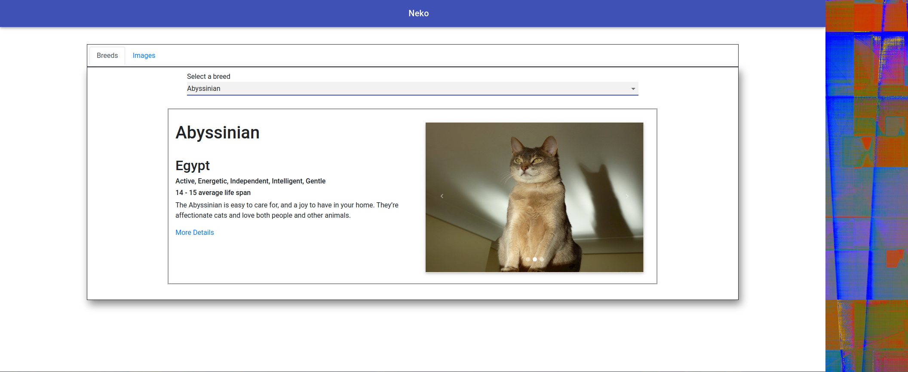
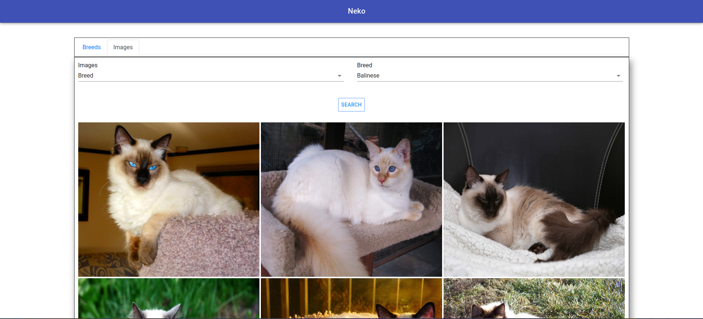
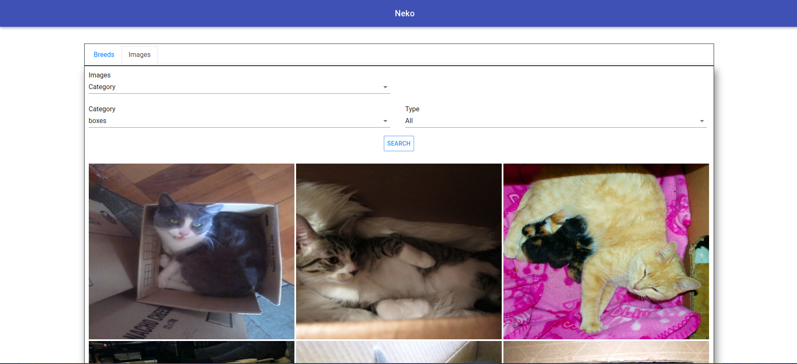
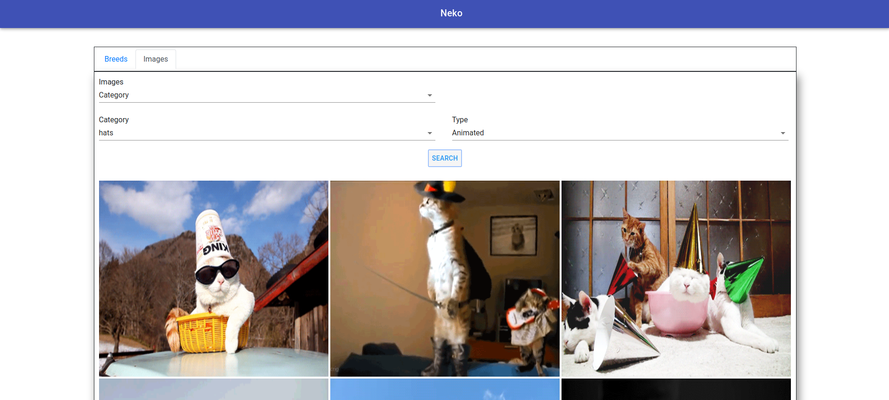

# Neko-react

## Description
- Website built using the ```thecatapi```.
- The website is able to give information of each cat's breed.
- Is possible to see images of cats by breed and category.
- You can decide to choose animated or static image for the category.

## Instructions
- Open your terminal.
- Clone the project typing: ```https://github.com/LeoRoma/neko-react.git```.
- Enter in folder project with ```cd neko-react``` and ```cd neko```.
- Run ```npm install``` to install dependencies.
- Type ```npm start``` to start React's server.
- To visit the website type ```http://localhost:3000/``` on your browser

## Important
- After you cloned the repository on your folder and you ran ```npm install``` gives you a bug, doesn't load ```react-bootstrap``` plese run ```npm install react-bootstrap bootstrap``` to fix this bug
 

## Tech
- React
- React Router Dom
- MDBoostrap
- Material UI
- react-bootstrap bootstrap
- ReactPlayer

## Screenshots

## Search by breeed 


## Search images by breed


## Search images by category


## Search images by category and format
